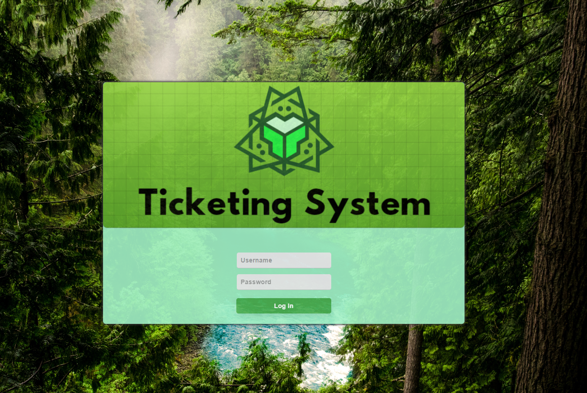
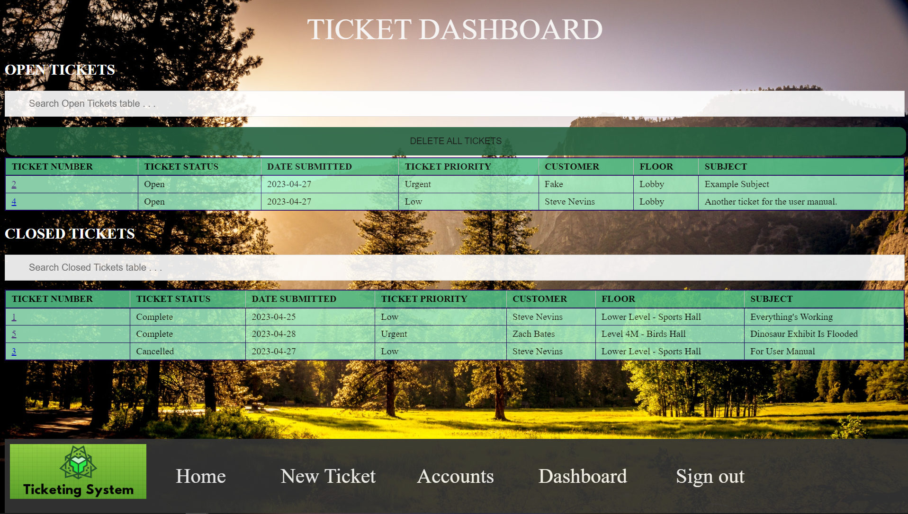
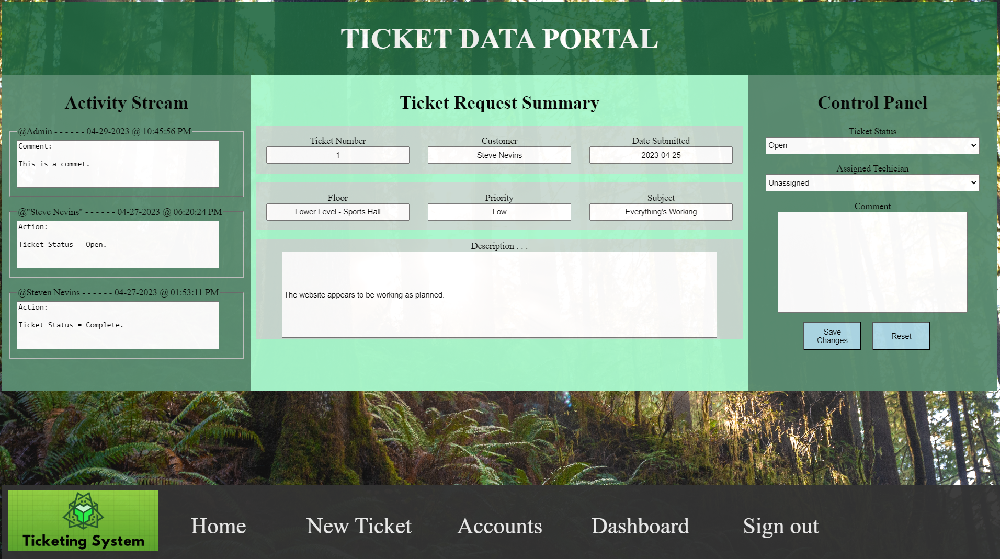
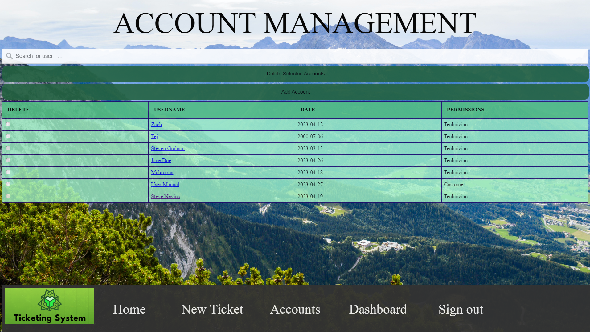
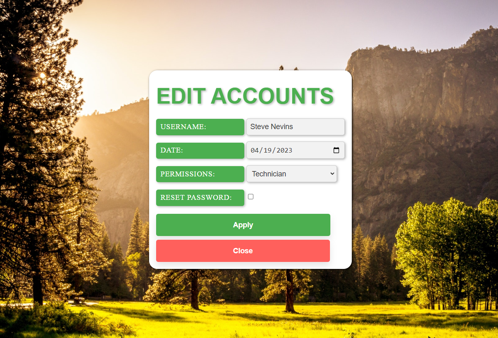
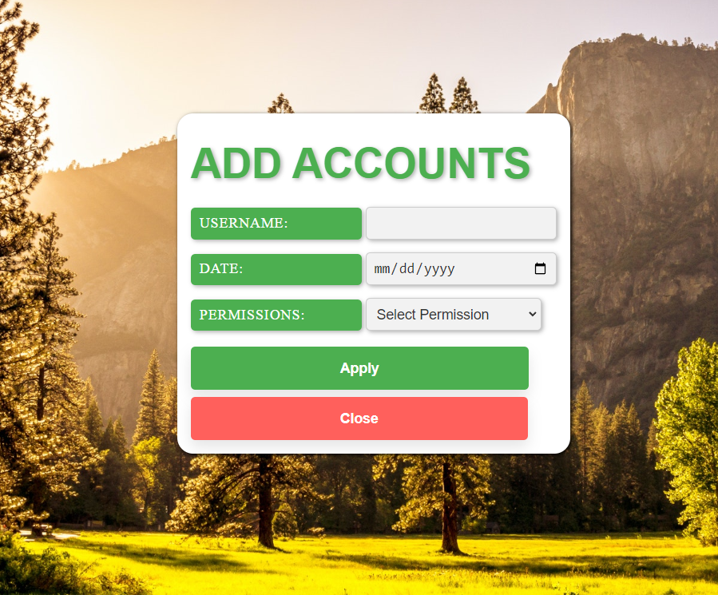
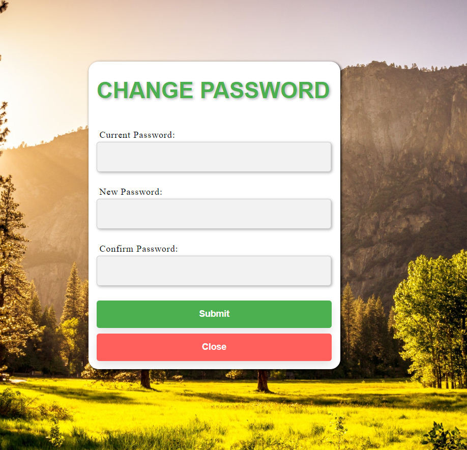

<!-- Introductory Header -->
 

  

  <h1 align="center">Perot Museum of Nature and Science</h1>

  

    This is a prototype IT ticketing system for the Perot Museum of Nature and Science; it was developed by a group of Computer Science students, attending Sacramento State Unviversity in the Fall and Spring of 2022 and 2023, respectively.
   

    <h2> <a href="https://github.com/babyhuey616/Ticketing-System/tree/main/Ticket-System"><strong> Explore our system's files » </strong></a> </h2> 

<!-- ABOUT THE PROJECT -->

## About The Project

### < Introduction >

This project was initiated in accordance with California State University, Sacramento's (CSUS) Computer Science (CS) undergrad graduation requirements. According to the current (as of 2022) CS undergrad course catalog, each CS student - along with a team of up to seven other CS seniors - must complete a year-long, computer science driven project as part of their senior year class load. The project must fulfill a business need for the given client; the client and subsequent project are subject to approval by the CSUS Computer Science Department. 

### < Team - Coding Nerds >

The developers on this project consist of seven Computer Science seniors. We collectively decided to name our team "Coding Nerds"; this is both due to the fact that we are objectively nerds and also do a whole lot of coding. 

Here is a list of our team members:
* Steve Nevins (Team Lead)
* Alex Escobar
* Steven Graham
* Eric Plocher
* Tej Panchal
* Brian Pham
* Mahroona Yasar

### < Client - Perot Museum of Nature and Science >

Our client's business is the Perot Museum of Nature and Science, located in Dallas, Texas. The museum contains over 100 nature and science related exhibits, which notably include  a dinosaur exhibit, bird exhibits, an engineering exhibit, and a gem and mineral exhibit. The museum also hosts education outreach programs such as school field trips, in-school presentations, and virtual programs.

### < Project - Develop an Improved IT Ticketing System >

The museum currently utilizes a third-party, online ticketing system, which allows employees to request services from the museums's IT team and subsequently provides the IT team the ability to track, distribute, and resolve tickets requested by the museum’s employees. Our client feels that the current system is often unintuitive and inefficient for both the IT team and the museum staff; the IT employees often finds themsevles in circumstances in which they are forced to navigate an excessive number of pages and data to locate, update, and coordinate various tickets. Our client has tasked us with producing a more refined and productive website to use when allocating work tickets for the IT team. Our goal is to create a functional prototype that meets the needs of our client before integrating it onto the museum's existing servers for future use by their in-house maintenance department.

## Delivered Product

### Application Summary

In accordance with our client’s needs, we developed a fully-functioning, web-based ticketing system. The ticketing system was built to serve the needs of the museum’s employees by providing a mechanism to request and monitor tickets; it also serves the needs of the museum’s IT team by providing a mechanism to view and modify tickets and manage access to the ticketing system. 

The system can be accessed by museum employees and the museum’s IT staff, both of whom have separate use cases. In light of that, two distinct permission levels have been implemented into the system’s structure, which have been designed to dictate the content and features accessible by the end user. Museum employees are viewed as “Customers” and IT Staff are viewed as “Technicians”.

### System Pages

<b> Login page: </b>

<b> Description: </b> 

The login page is the landing page for anyone with access to the website's url. If valid credentials for a "Customer" or "Technician" are provided, the end user will
be directed to the system's home page.

<b> Home Page: </b>

<b> Description: </b> 

The home screen acts as the central hub for the website. It contains a simple nav bar at the top of the screen, which provides access to all of the website's main pages; additionally, the username and permission level for logged in user are displayed at the bottom left of the screen. 

<b> Ticket Request Page: </b>

<b> Description: </b> 

The ticket request page can be accessed by users of all permission levels in the system; it contains a simple form, which prompts the user for information related
to the issue they are facing. Various input validation features exist that help guide the user through the form submission process. All tickets submitted via this page populate in the Ticket Dashboard. 

<b> Ticket Dashboard: </b>

<b> Description: </b> 

This page serves as the central hub for viewing tickets in the system. All tickets that are successfully submitted in the Ticket Request Page populate to the Open Tickets table in the Ticket Dashboard. Ticket's that are subsequently closed or completed are moved to the Closed Tickets table. 

<b> Individual Ticket View </b> 

<b> Description: </b> 

Individual ticket data can be accessed by clicking on the ticket number of any ticket in the Ticket Dashboard. From this page, you can view the static information from when the ticket was originally submitted. The control panel provides a mechanism manipulate the ticket's status, assigned technician, and make comments on the ticket; these updates all register to the ticket's activity stream.

Note: this page is only accessible to user's registered as Technicians.

<b> Accounts Dashboard </b> 

<b> Description: </b> 

This page serves as the central hub for managing access to the system. From here, accounts can be searched, sorted, deleted, modified, and added. 

Note: this page is only accessible to user's registered as Technicians.

<b> Modify Accounts Page </b> 

<b> Description: </b> 

If the username of a given account is selected in the Accounts Dashboard, this page will populate; it provides a mechanism to modify all information related to the given account. 

<b> Add Accounts Page </b> 

<b> Description: </b> 

If the "Add Account" button is selected in the Accounts Dashboard, this page will populate; it provides a mechanism to add an account to the system.

<b> Reset Password Page </b> 

<b> Description: </b> 

This page is only accessible via the nav bar on the home screen; it can be used to reset the password of the given user. 

### Implement GUIs and functionality into web pages (Sprint 02 & 03 - completed in November, 2022)

Login page (includes password/username functionality):

Ticket dashboard (includes search and sort feature):

Account management dashboard (includes search and sort features):

Ticket request portal (includes functioning drop downs and fields):

Individual ticket view (includes functioning activity stream):

General nav (this is the homepage - navbar included in other screen shots):

### Assemble server and relevant database componenets (Work In Progress)

### Connect webpages to server (Work In Progress)

### Establish and perform system testing (Work In Progress)

### Deploye to customer (Work In Progress)

## Developer and customer guidance (Work in Progres)

This section will be used to document guidance for developers and users.

