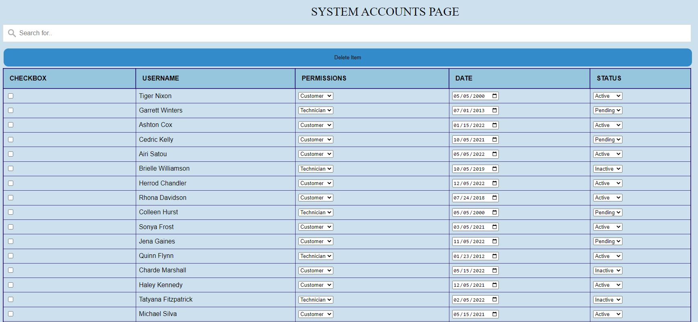
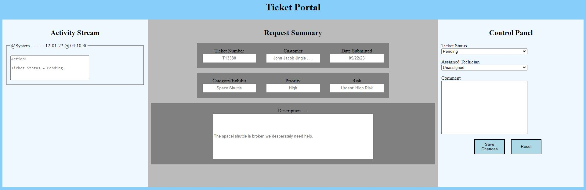

<!-- Introductory Header -->
 

  

  <h1 align="center">Perot Museum of Nature and Science</h1>

  

    This is a prototype IT ticketing system for the Perot Museum of Nature and Science; it was developed by a group of Computer Science students, attending Sacramento State Unviversity in the Fall and Spring of 2022 and 2023, respectively.
   

    <h2> <a href="https://github.com/othneildrew/Best-README-Template"><strong> Explore our system's files » </strong></a> </h2> 

<!-- ABOUT THE PROJECT -->

## About The Project

### < Introduction >

This project was initiated in accordance with California State University, Sacramento's (CSUS) Computer Science (CS) undergrad graduation requirements. According to the current (as of 2022) CS undergrad course catalog, each CS student - along with a team of up to seven other CS seniors - must complete a year-long, computer science driven project as part of their senior year class load. The project must fulfill a business need for the given client; the client and subsequent project are subject to approval by the CSUS Computer Science Department. 

### < Team - Coding Nerds >

The developers on this project consist of seven Computer Science seniors. We collectively decided to name our team "Coding Nerds"; this is both due to the fact that we are objectively nerds and also do a whole lot of coding. 

Here is a list of our team members:
* Steve Nevins (Team Lead)
* Alex Escobar
* Steven Graham
* Eric Plocher
* Tej Panchal
* Brian Pham
* Mahroona Yasar

### < Client - Perot Museum of Nature and Science >

Our client's business is the Perot Museum of Nature and Science, located in Dallas, Texas. The museum contains over 100 nature and science related exhibits, which notably include  a dinosaur exhibit, bird exhibits, an engineering exhibit, and a gem and mineral exhibit. The museum also hosts education outreach programs such as school field trips, in-school presentations, and virtual programs.

### < Project - Develop an Improved IT Ticketing System >

The museum currently utilizes a third-party, online ticketing system, which allows employees to request services from the museums's IT team and subsequently provides the IT team the ability to track, distribute, and resolve tickets requested by the museum’s employees. Our client feels that the current system is often unintuitive and inefficient for both the IT team and the museum staff; the IT employees often finds themsevles in circumstances in which they are forced to navigate an excessive number of pages and data to locate, update, and coordinate various tickets. Our client has tasked us with producing a more refined and productive website to use when allocating work tickets for the IT team. Our goal is to create a functional prototype that meets the needs of our client before integrating it onto the museum's existing servers for future use by their in-house maintenance department.

## Project Summary

### Milestones

- [x] Find approved client and project.
- [x] Establish project requirements.
- [x] Develop GUI prototypes.
    - [x] Login page.
    - [x] Ticket dashboard.
    - [x] Account management dashboard.
    - [x] Ticket request portal.
    - [x] Individual ticket views.
- [x] Implement guis into webpages.
- [x] Add functionality and cohesiveness to webpages
    - [x] Login mechanism.
    - [x] Search, sort, and filter options for data.
    - [x] Ticket activity tracking.
    - [x] General system navigation.
    - [x] Unified color schemes and images.
- [ ] Assemble server and relevant databases components. 
- [ ] Connect webpages to server.
- [ ] Establish and perform system testing.
- [ ] Deploy to customer. 

### Find approved client and project (completed early-October, 2022)

The Perot Museum of Nature and Science was officially selected as our client in early October of 2022.

### Establish project requirements (Sprint 00 - completed in mid-October, 2022)

Basic project requirements were established in mid-October of 2022. A requirements document was assembled in Jira (this is a project management software) to track and manage all articulated requirements. The document is organized by the webpages needed for the ticketing system.

### Develop GUI prototypes (Spring 01 - completed in late-October, 2022)

Login page:

Ticket dashboard:

Account management dashboard:

Ticket request portal:

Individual ticket view:

### Implement GUIs and functionality into web pages (Sprint 02 & 03 - completed in November, 2022)

Login page (includes password/username functionality):

Ticket dashboard (includes search and sort feature):

Account management dashboard (includes search and sort features):

Ticket request portal (includes functioning drop downs and fields):

Individual ticket view (includes functioning activity stream):

General nav (this is the homepage - navbar included in other screen shots):

### Assemble server and relevant database componenets (Work In Progress)

### Connect webpages to server (Work In Progress)

### Establish and perform system testing (Work In Progress)

### Deploye to customer (Work In Progress)

## Developer and customer guidance (Work in Progres)

This section will be used to document guidance for developers and users.

