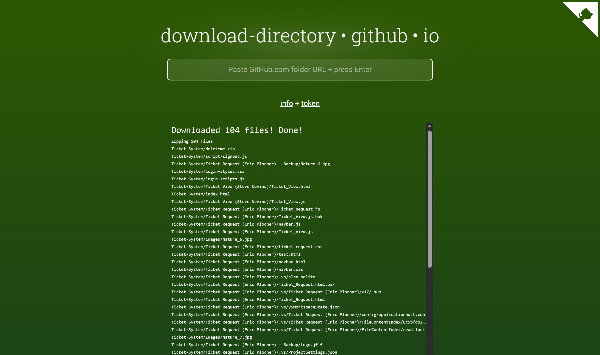
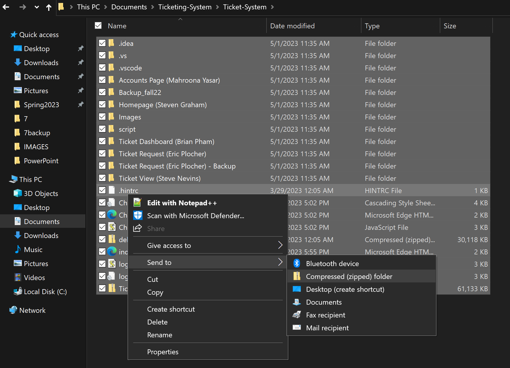
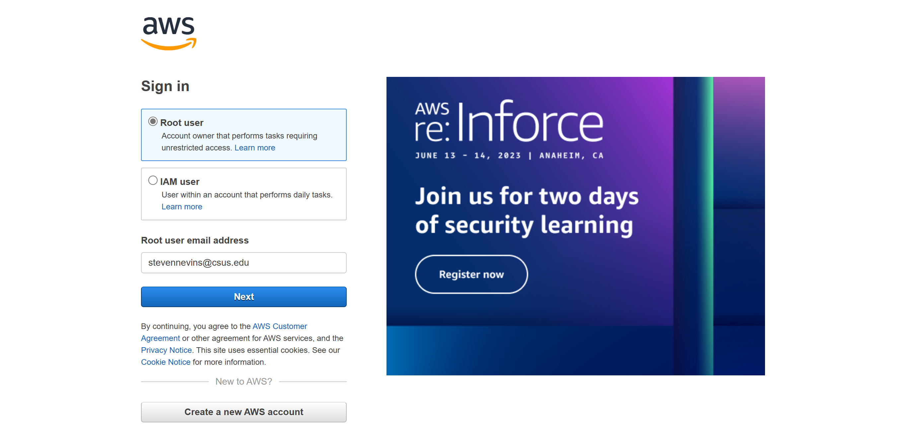
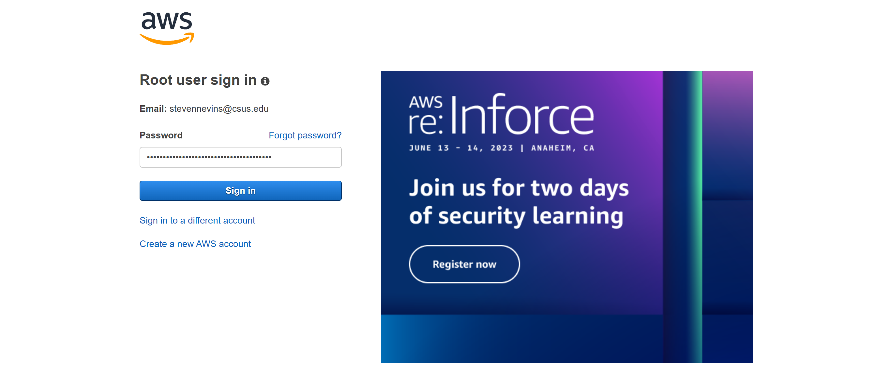
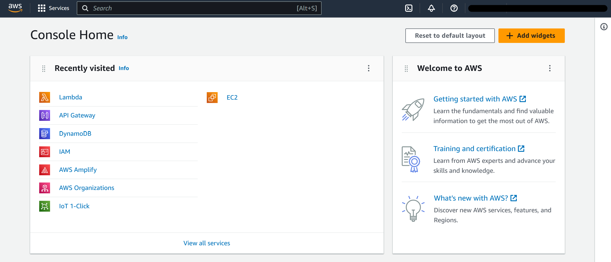
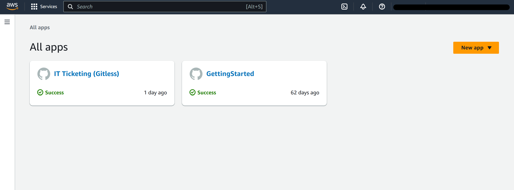
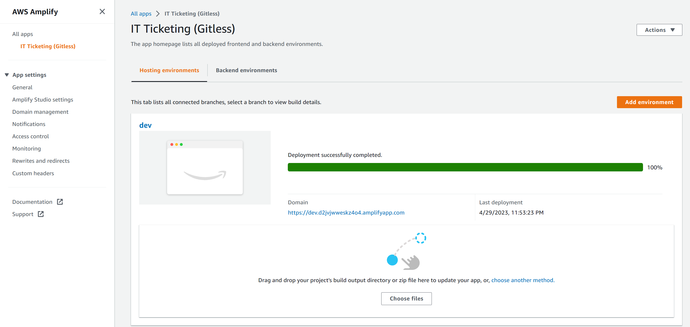

<!-- Introductory Header -->
 

  

  <h1 align="center">Perot Museum of Nature and Science</h1>

  

    This is a prototype IT ticketing system for the Perot Museum of Nature and Science; it was developed by a group of Computer Science students, attending Sacramento State Unviversity in the Fall and Spring of 2022 and 2023, respectively.
   

    <h2> <a href="https://github.com/babyhuey616/Ticketing-System/tree/main/Ticket-System"><strong> Explore our system's files » </strong></a> </h2> 

<!-- ABOUT THE PROJECT -->

## About The Project

### < Introduction >

This project was initiated in accordance with California State University, Sacramento's (CSUS) Computer Science (CS) undergrad graduation requirements. According to the current (as of 2022) CS undergrad course catalog, each CS student - along with a team of up to seven other CS seniors - must complete a year-long, computer science driven project as part of their senior year class load. The project must fulfill a business need for the given client; the client and subsequent project are subject to approval by the CSUS Computer Science Department. 

### < Team - Coding Nerds >

The developers on this project consist of seven Computer Science seniors. We collectively decided to name our team "Coding Nerds"; this is both due to the fact that we are objectively nerds and also do a whole lot of coding. 

Here is a list of our team members:
* Steve Nevins (Team Lead)
* Alex Escobar
* Steven Graham
* Eric Plocher
* Tej Panchal
* Brian Pham
* Mahroona Yasar

### < Client - Perot Museum of Nature and Science >

Our client's business is the Perot Museum of Nature and Science, located in Dallas, Texas. The museum contains over 100 nature and science related exhibits, which notably include  a dinosaur exhibit, bird exhibits, an engineering exhibit, and a gem and mineral exhibit. The museum also hosts education outreach programs such as school field trips, in-school presentations, and virtual programs.

### < Project - Develop an Improved IT Ticketing System >

The museum currently utilizes a third-party, online ticketing system, which allows employees to request services from the museums's IT team and subsequently provides the IT team the ability to track, distribute, and resolve tickets requested by the museum’s employees. Our client feels that the current system is often unintuitive and inefficient for both the IT team and the museum staff; the IT employees often finds themsevles in circumstances in which they are forced to navigate an excessive number of pages and data to locate, update, and coordinate various tickets. Our client has tasked us with producing a more refined and productive website to use when allocating work tickets for the IT team. Our goal is to create a functional prototype that meets the needs of our client before integrating it onto the museum's existing servers for future use by their in-house maintenance department.

## Delivered Product

### Application Summary

In accordance with our client’s needs, we developed a fully-functioning, web-based ticketing system. The ticketing system was built to serve the needs of the museum’s employees by providing a mechanism to request and monitor tickets; it also serves the needs of the museum’s IT team by providing a mechanism to view and modify tickets and manage access to the ticketing system. 

The system can be accessed by museum employees and the museum’s IT staff, both of whom have separate use cases. In light of that, two distinct permission levels have been implemented into the system’s structure, which have been designed to dictate the content and features accessible by the end user. Museum employees are viewed as “Customers” and IT Staff are viewed as “Technicians”.

### System Pages

<b> Login page: </b>

<b> Description: </b> 

The login page is the landing page for anyone with access to the website's url. If valid credentials for a "Customer" or "Technician" are provided, the end user will
be directed to the system's home page.

<b> Home Page: </b>

<b> Description: </b> 

The home screen acts as the central hub for the website. It contains a simple nav bar at the top of the screen, which provides access to all of the website's main pages; additionally, the username and permission level for logged in user are displayed at the bottom left of the screen. 

<b> Ticket Request Page: </b>

<b> Description: </b> 

The ticket request page can be accessed by users of all permission levels in the system; it contains a simple form, which prompts the user for information related
to the issue they are facing. Various input validation features exist that help guide the user through the form submission process. All tickets submitted via this page populate in the Ticket Dashboard. 

<b> Ticket Dashboard: </b>

<b> Description: </b> 

This page serves as the central hub for viewing tickets in the system. All tickets that are successfully submitted in the Ticket Request Page populate to the Open Tickets table in the Ticket Dashboard. Ticket's that are subsequently closed or completed are moved to the Closed Tickets table. 

<b> Individual Ticket View </b> 

<b> Description: </b> 

Individual ticket data can be accessed by clicking on the ticket number of any ticket in the Ticket Dashboard. From this page, you can view the static information from when the ticket was originally submitted. The control panel provides a mechanism to manipulate the ticket's status, assigned technician, and make comments on the ticket; these updates all register to the ticket's activity stream.

Note: this page is only accessible to user's registered as Technicians.

<b> Accounts Dashboard </b> 

<b> Description: </b> 

This page serves as the central hub for managing access to the system. From here, accounts can be searched, sorted, deleted, modified, and added. 

Note: this page is only accessible to user's registered as Technicians.

<b> Modify Accounts Page </b> 

<b> Description: </b> 

If the username of a given account is selected in the Accounts Dashboard, this page will populate; it provides a mechanism to modify all information related to the given account. 

<b> Add Accounts Page </b> 

<b> Description: </b> 

If the "Add Account" button is selected in the Accounts Dashboard, this page will populate; it provides a mechanism to add an account to the system.

<b> Reset Password Page </b> 

<b> Description: </b> 

This page is only accessible via the nav bar on the home screen; it can be used to reset the password of the given user. 

## System Testing

### Introduction

The final product delivered by our team consists of a data-driven interface and various ticketing and account management related features. A comprehensive suite of functional tests has been assembled to test all the GUI components of the webpage; additionally, several automated, unit tests have been configured to test the system’s back end.

### Functional Testing Conditions

Our functional tests are designed to assess all features accessible via the the website's graphical user interface. These tests have been organized by the various webpages in which the features are visible. All tests include a description, expected behaviour, date, tester's name, and the results. Images of the tests results are also included in each test to further clearly illustrate the outcome.  

### Unit Testing Conditions

The website's backend is powered by AWS. We specifically utilized AWS’s dynamo database services to store data related to the ticketing system, and we designed 12 distinct lambda functions to access and manipulate that data. Each of the lambda functions can be triggered directly via the webpage when a given event occurs; however, the functions can also be tested via built-in unit tests, in which mock JSON data is passed to and from the function. We have assembled a minimum of one such unit test for each function.

## Deployment Instructions

### Downloading The System Files

In order to deploy the website, you must save a local copy of the system's files to your PC. There are two available mechanisms to complete this process:

<b> 1. Download Without GitHub > </b>

   
To download a copy of the system's files without github, simply go to <a href="https://download-directory.github.io/?url=https%3A%2F%2Fgithub.com%2Fbabyhuey616%2FTicketing-System%2Ftree%2Fmain%2FTicket-System">this</a> link; a copy of the system's files will automatically download to your device. The files will be stored in a zipped file named "babyhuey616 Ticketing-System main Ticket-System"; simply unzip this file then proceed to the deployment section.
   
<b> 2. Download With GitHub > </b>

Sign in with the GitHub Desktop application and you will be prompted with all your available repositories. Navigate to "babyheuy616/Ticketing-System", from here you will be prompted to pull origin of the repository where the application will pull from the GitHub repository and store it as default in C:\Users\'username'\GitHub\Ticketing-System from here you may proceed to the deployment section.

### Deploying Via AWS Amplify

The website is hosted via AWS's Amplify web hosting platform. Follow these steps to publish the system's files via Amplify's service:

<b> 1. Prepare The System Files > </b>

You'll need to zip the system files that you just downloaded to your local device. Note that you cannot simply zip the parent file in which the system files are     contained: you must zip the files by selecting them all and then sending them to a compressed zip folder. 

<b> 2. Log Into The Team's AWS Account > </b>

You can access the login page <a href="https://signin.aws.amazon.com/signin?redirect_uri=https%3A%2F%2Fconsole.aws.amazon.com%2Fconsole%2Fhome%3FhashArgs%3D%2523%26isauthcode%3Dtrue%26nc2%3Dh_ct%26src%3Dheader-signin%26state%3DhashArgsFromTB_us-west-2_d220f71efef85d34&client_id=arn%3Aaws%3Asignin%3A%3A%3Aconsole%2Fcanvas&forceMobileApp=0&code_challenge=aRF2ZixfCaj2htUXwXT6eZkRfoVJIQxUHBchCQCDpbI&code_challenge_method=SHA-256"> here </a>. The team's Root user email address is "stevennevins@csus.edu". 
After entering that email address, select "Next". 

You'll be taken to a screen prompting you for the password for the team's account; this has been provided to the client. Enter the provided password and select "Sign In". 

<b> 3. Boot Up AWS Amplify > </b>

After successfully logging into the Team's AWS account, you'll be taken to the "Console Home". This screen contains a list of the different AWS services utilized by the team. Select the service labeled "AWS Amplify". 

<b> 4. Open The Website's Hosting App > </b>

You'll be taken to a screen with the team's web hosting apps. The application used to host the website is labeled "IT Ticketing (Gitless)"; select this app. 

<b> 5. Deploy App > </b> 

The hosting platform will appear. At the bottom of the screen, there is a section in which you can drag and drop files for deployment; simply drag and drop the zipped file from step one. The application will automatically deploy those files. 

<b> 6. View Deployed Website > </b> 

After the deployment has finished, a link labeled as "Domain" will populate to the middle of the screen; this link will take you to the homepage of the newly deployed website. Congragulations! The website is now up and running!
